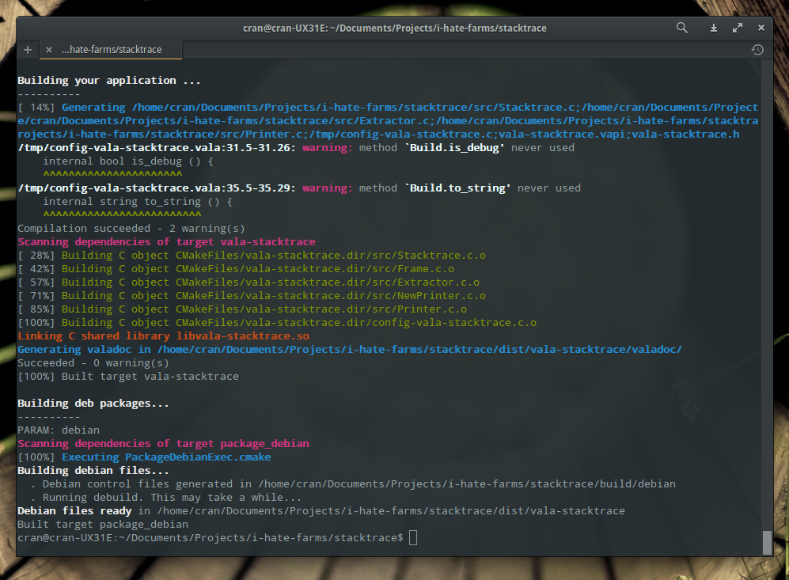

## Introduction
**hen** builds and packages your vala projects in a simple declarative way.

It implements sane defaults and uses [cmake](http://cmake.org/) under the hood, meaning it works where cmake works (nearly everywhere)

All is needed in **only one** `project.hen` file describing your whole project.

```java
# This new application will conquer the world
application (
    AUTHOR
        "Your self <your.self@home.com>"
    HOMEPAGE
        "https://home.com/your-application"      
    LICENSE
        "Apache 2.0"  
    NAME
        your-application
    TITLE
        "This application will be great"
    VERSION
        "1.0"
    SOURCE_PATH
        src
    PACKAGES
        gtk+-3.0
)

```
Then type `hen build` to build your application and `hen package` to create `.deb` files ready for distribution.

 

If you want to run your application, type `hen run` or `hen debug` to start a `gdb` debugging session.

> note: the `project.hen` is a cmake file you can use whatever cmake instructions to spice it.

## Features: 
  - build and install gui/console applications, libraries and plugins using a simple declarative syntax
  - generate a wide array of files for you: .desktop and icons for applications, .pc .deps for lbraries
  - one stop commmand script `./hen` for all the common tasks: build, rebuild, install, etc.
  - auto-install itself and more important *auto-update* via `./hen update`

## Getting started 

```
curl -sL  http://i-hate-farms.github.io/hen/install | bash -  
```

More information in the [gettting started section](docs/getting-started.md).

## Rodmap to 1.0 
  - [ ] handle application icons and images 
  - [ ] handle po files and translations
  - [ ] finish up valadoc task
  - [ ] documentation and test suite

## Samples

You can find samples for: 
  - [vala-stacktrace][1]: a library and a sample command line test program
  - [eidete][2]: an elementary gtk app
  - [useraccounts][4]: an elementary [switchboard][3] plug 
  - [webcontracts][5]: an elementary plug shipping with a cli application 
  - [gtk-test][6]: a simple Gtk application
  - [cli-test][7]: a simple command line application

[1]: https://github.com/PerfectCarl/vala-stacktrace
[2]: https://code.launchpad.net/~name-is-carl/eidete/use-elementary.cmake
[3]: https://launchpad.net/switchboard
[4]: https://code.launchpad.net/~name-is-carl/switchboard-plug-useraccounts/use-elementary.cmake
[5]: https://code.launchpad.net/~elementary-apps/webcontracts/fix-for-freya
[6]: none
[7]: none


## [Documentation](docs/doc.md) 

## [Changelog](CHANGELOG.md)
